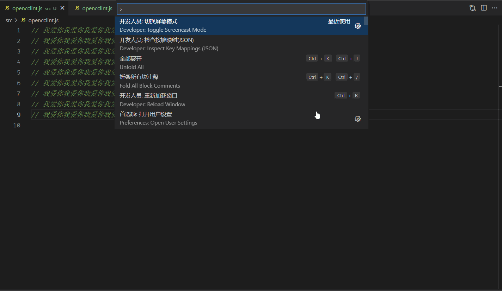
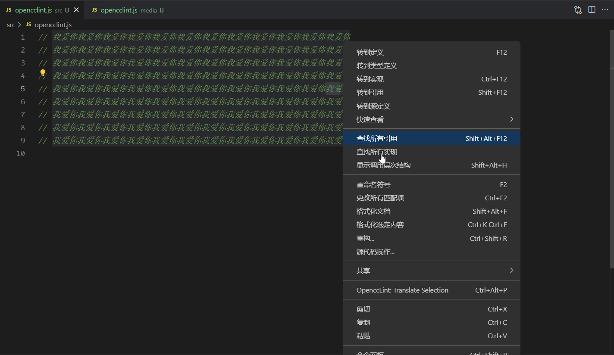
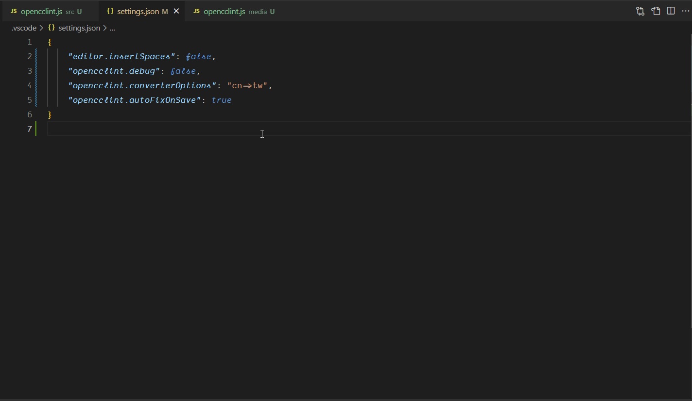

# opencclint README

使用 opencc 转换繁简体，可添加多种自定义配置，如忽略文字，忽略文件，保存自动转换。

## 特性

- [文件转换繁简体](#文件转换繁简体)。
- [文本选中转换繁简体](#文本选中转换繁简体)。
- [保存文件自动转换繁简体](#保存文件自动转换繁简体)。
- [转换快捷键](#快捷键列表)。
- [可配置忽略文件、忽略文件夹、忽略词组](#配置文件)。

### 文件转换繁简体

参考[示例文件夹](/example)配置。

#### 使用方法

- 当前文件，使用快捷键：`Ctrl+Alt+O` 在 Windows 和 Linux 上，或 `Option+CMD+O` 在 OSX 上。
- 当前文件，调出命令面板（`F1`，或 `Ctrl+Shift+P` 在 Windows 和 Linux 上，或 `Shift+CMD+P` 在 OSX 上），输入`OpenccLint: Translate File`。

#### 示例



### 文本选中转换繁简体

#### 使用方法

- 选中文本，使用右键菜单，点击: `OpenccLint: Translate Selection` 选项。
- 选中文本，使用快捷键 `Ctrl+Alt+P` 在 Windows 和 Linux 上，或 `Option+CMD+P` 在 OSX 上。
- 选中文本，调出命令面板（F1，或Ctrl+Shift+P在 Windows 和 Linux 上，或Shift+CMD+P在 OSX 上），输入`OpenccLint: Translate Selection`。

#### 示例



### 保存文件自动转换繁简体

#### 使用方法

需要在[配置文件](#%E9%85%8D%E7%BD%AE%E6%96%87%E4%BB%B6)中开启 `"opencclint.autoFixOnSave": true`。

默认可自动保存文件格式包括：`"opencclint.languages": ["vue", "plaintext", "html", "typescript", "javascript", "jsx", "jsonc", "php"]`，可手动修改，修改后默认值不可用。

如果不太清楚文件的格式，可以开启 `"opencclint.debug": true`，查看文件的 `languageId`，如：`"languageId":"javascript"`。

```jsonc
{
  "opencclint.autoFixOnSave": true,
  "opencclint.languages": ["vue", "plaintext", "html", "typescript", "javascript", "jsx", "jsonc", "php"],
}
```

#### 示例



## 配置文件

- `ignoreWords`: 需要忽略的文本，如：台湾 => 台(~~臺~~)灣。
- `exclude`: 需要排除的文件或文件夾，參照：[.gitignore spec 2.22.1](https://git-scm.com/docs/gitignore)

根目录添加 `.opencclintrc.json` 文件，如果使用了 [opencclint](https://github.com/hddhyq/opencclint) ，则可以直接在 `simplify.config.js` 配置。两个配置文件保留一个就行，如果两个文件都存在，配置将会合并。

> 修改配置文件后需要重启编辑器窗口。

```js
// .opencclintrc.json
{
  "ignoreWords": ["台", "里", "周"],
  "exclude": [
    "node_modules",
    "dist"
  ]
}

// simplify.config.js
{
  "ignoreTexts": {
    台: '臺',
    里: '裡',
    周: '週'
  },
  "exclude": [
    "node_modules",
    "dist"
  ]
}
```

## 插件配置

|      配置       |           默认值 |           备注  |
|-----------------|-----------------|-----------------|
|`opencclint.converterOptions`|`cn=>tw`|opencc 转换配置项, ["cn", "tw", "twp", "hk", "jp", "t"] 参考：[api](https://github.com/nk2028/opencc-js#api)|
|`opencclint.autoFixOnSave`|`false`|是否开启自动保存|
|`opencclint.languages`|`["vue", "plaintext", "html", "typescript", "javascript", "jsx", "jsonc", "php"]`|需要自动保存的文件格式|
|`opencclint.debug`|`false`|查看debug信息|

## 指令列表

|指令|描述|
|---|----|
|`OpenccLint: Translate File`| 转换当前文件繁简体|
|`OpenccLint: Translate Selection`| 转换当前选中文本繁简体|

## 快捷键列表

|快捷键|描述|
|---|----|
|`Ctrl+Alt+O` 或 `Option+CMD+O`| 转换当前文件繁简体|
|`Ctrl+Alt+P` 或 `Option+CMD+P`| 转换当前选中文本繁简体|

## 暂不支持

- 多工作区(多个项目在同一个窗口打开)。
- 忽略编程语言注释。

## Release Notes

### 0.0.1(2022-07-26)

添加命令行转换文件

### 0.0.2(2022-08-15)

添加自动保存转换功能及配置文件。

### 0.0.3(2022-12-14)

修复 twp=>cn 模式下，转换异常。

### 0.0.4(2022-12-17)

修复 translateSelection 转换异常。

## 感谢

- [OpenCC](https://github.com/BYVoid/OpenCC)
- [opencc-js](https://github.com/nk2028/opencc-js)
